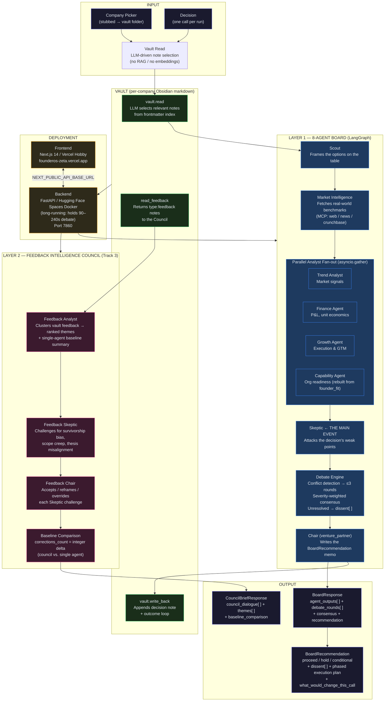

# FounderOS — System Architecture Diagram

## Two-Layer Agent Society

FounderOS operates two coordinated agent systems. The **Board** (8 agents) evaluates business decisions. The **Feedback Intelligence Council** (3 agents) stress-tests accumulated feedback from the vault — demonstrating measurable efficiency gains over single-agent analysis.



## Track 3: Agent Society — How the Criteria Map

| Track 3 Criterion | FounderOS Implementation |
|---|---|
| **Task decomposition + role assignment** | 11 agents across 2 layers, each with a distinct system prompt and strict input/output shape |
| **Dialogue and negotiation** | `council_dialogue: CouncilTurn[]` — every agent's message is recorded and rendered in the UI |
| **Conflict resolution mechanisms** | Debate engine: conflict detection → revision rounds → severity-weighted consensus. Feedback Council: `overrides[]` records accepted / reframed / overridden per Skeptic challenge |
| **Measurable efficiency gain** | `baseline_comparison.corrections_count` — the integer delta between what a single agent reports and what the council catches |

## Cross-Track Elements

| Track | Element in FounderOS |
|---|---|
| **Track 1 — MemoryAgent** | The vault: per-company Obsidian markdown with LLM-driven selective retrieval. The board "remembers" prior decisions across sessions without loading the whole vault into context. |
| **Track 4 — Autopilot Agent** | The `execution_plan` in `BoardRecommendation`: a phased (Validate → Pilot → Scale) business workflow generated automatically from the board debate. |

## API Surface

```
POST /api/analyze          → BoardResponse       (the 8-agent board run)
GET  /api/response/{id}    → BoardResponse       (fetch saved run)
POST /api/feedback         → { status: "ok" }   (outcome loop → vault)
GET  /api/company/{id}     → vault index         (decision history)
POST /api/council-brief    → CouncilBriefResponse  (Track 3 council run)
```
